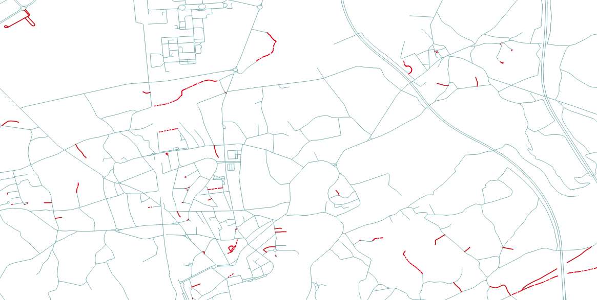

# OSM-HighwayCompare

A simple NodeJs tool that compares geospatial features (highways for now) from an up-to-date layer to OpenStreetMap data
and returns any missing geometries. Uses Tile-Reduce, a geoprocessing library that implements
[MapReduce](https://en.wikipedia.org/wiki/MapReduce), to scale this comparison into the large.

## Dependencies
* [Tile-Reduce](https://github.com/mapbox/tile-reduce)
* [Turfjs](https://github.com/Turfjs/turf)

## Usage

At the moment, three input files are required:
* A groundtruth geojson feature collection that will be used to complete the osm layer (it is assumed that
this only contains highways);
* A bounding box (geojson geometry) used to reduce the scope of the comparison;
* And a [MBtiles](https://wiki.openstreetmap.org/wiki/MBTiles) file containing the
latest osm data to be updated.

```
nodejs index.js -g groundtruth.geojson -b boundingbox.geojson -m osm.mbtiles -o output.geojson
```

The output will contain four sets of feature collections: the groundtruth and osm layer corresponding
 to the input bounding box and the computed geometries that are missing or partially missing on the osm layer.
 If no output file is specified, the result will be stored into "osmdiff.geojson".

## Dataset

Coming very soon...

## Example

An output example computed by this tool. The outdated OSM layer styled in blue lines. In red lines,
the missing geometries. And in red dashed lines the partially missing.
